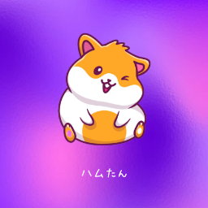

# hmks-forever
## ハムたんの非公式(本人公認)のまとめ
 

<a href="https://twitter.com/intent/tweet?text=%23%E3%83%8F%E3%83%A0%E3%82%AB%E3%82%B9%E3%83%95%E3%82%A9%E3%83%BC%E3%82%A8%E3%83%90%E3%83%BC%0A%0Ahttps%3A%2F%2Fotoneko1102.github.io%2Fhmks-forever%2F" target="_blank" class="tweet-button">
  

    
  

  「#ハムカスフォーエバー」 をツイート
</a>

<a href="https://otoneko1102.github.io/hmks-forever/" target="_blank">ページに飛ぶ</a>
